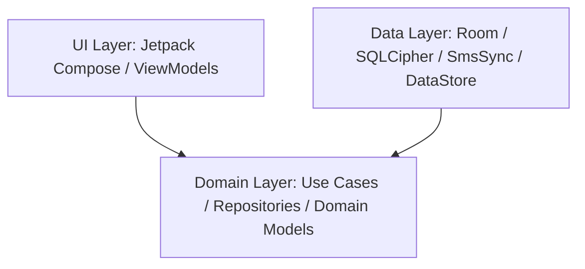

# SmsX 📱🔐

SmsX is a production-ready, privacy-focused, offline-first SMS & MMS client for Android. Built on modern Android development practices, SmsX guarantees absolute messaging privacy by operating completely offline (with zero internet permission) and securing all local data using AES-256 database encryption.

---

## 🌟 Key Features

- **Zero Network Footprint**: The app does not request or require the `android.permission.INTERNET` permission. All processing and message operations occur strictly on-device, ensuring zero chance of data leaks.
- **Room + SQLCipher Database Encryption**: All message databases are encrypted. The database key is dynamically derived using PBKDF2 with HMAC-SHA256 from a combination of the user's secure PIN and the Android hardware ID (`Settings.Secure.ANDROID_ID`), protecting your messages from extraction.
- **Smart Queueing on Lock**: If a new SMS is received while the database is locked, it is queued securely in a local memory-safe private buffer file (`pending_sms.json`). It is automatically processed and merged into the encrypted Room database upon the next successful user unlock.
- **Biometric & PIN Lock Gating**: Gated by a premium App Lock Screen on startup. Users can configure a custom PIN or use biometric credentials (fingerprint/facial recognition) to authenticate.
- **Optimized Performance**: Features an in-memory contact lookup cache and bulk-query repository mappings to prevent layout bottlenecks and database scans, providing smooth scrolling and instantaneous thread loading even for databases with thousands of messages.
- **Future SMS Scheduling**: Send SMS at any specific date and time. Uses `WorkManager` & `AlarmManager` to ensure scheduling accuracy, even across device reboots.
- **Interactive Notifications**: Custom-designed system notifications supporting inline direct reply and immediate marking as read without opening the application.
- **Premium Material 3 Design**: Fully native Jetpack Compose UI with glassmorphic cards, smooth micro-animations, light/dark themes, and 6 custom-curated accent color palettes.

---

## 🛠️ Technology Stack

- **Language**: Kotlin
- **Minimum SDK**: 26 (Android 8.0)
- **Target SDK**: 34 (Android 14)
- **UI Framework**: Jetpack Compose (Material 3)
- **Dependency Injection**: Dagger Hilt
- **Asynchronous Programming**: Kotlin Coroutines & Flow (StateFlow, SharedFlow)
- **Database**: Room Persistence Library
- **Encryption**: SQLCipher for Android (net.zetetic:licsqlcipher-android)
- **Local Settings**: Jetpack DataStore (Preferences)
- **Image Loader**: Coil (for MMS image rendering)

---

## 🏛️ Architecture

The project adheres to **Clean Architecture** principles decoupled into three distinct layers to ensure modularity, readability, and testability:



### 1. Presentation (UI) Layer
- Built completely in **Jetpack Compose**.
- Implements the **MVVM** pattern. ViewModels expose UI state via `StateFlow` and handle user actions.
- Composable screens represent single screens in the app navigation graph (`AppNavGraph.kt`).

### 2. Domain Layer
- Written in pure Kotlin (devoid of Android dependencies where possible).
- Defines repository interfaces (`SmsRepository`, `BlocklistRepository`) and core models.
- Implements single-responsibility **Use Cases** for every discrete business operation (e.g., `GetConversationsUseCase`, `SendSmsUseCase`, `BlockNumberUseCase`).

### 3. Data Layer
- Implements repository interfaces defined in the Domain layer.
- Handles database transactions, content provider queries, preference read/writes, and background synchronization logic.
- Implements the `DatabaseManager` thread-safe singleton to manage key derivation and database lifecycle state (lock/unlock).

---

## 🚀 Getting Started

### Prerequisites
- [Android Studio Koala](https://developer.android.com/studio) or newer.
- JDK 17 or higher.
- A physical Android device or emulator running API level 26 or higher.

### Building and Running
1. Clone the project locally.
2. Open the project in Android Studio.
3. Build the project using the Gradle wrapper:
   ```bash
   ./gradlew assembleDebug
   ```
4. Install the debug build directly on your connected device (ensure USB Debugging is enabled):
   ```bash
   ./gradlew installDebug
   ```

### Running Tests
To run unit and instrumentation tests, execute:
```bash
./gradlew test
./gradlew connectedAndroidTest
```

---

## 🛡️ Security & PIN Setup Flow

1. On the very first launch, the app auto-generates a key based on a default initialization key.
2. The user is prompted to set up a secure PIN in Settings.
3. When the PIN is configured, the app uses SQLCipher's `PRAGMA rekey` command to secure the database using the new key derived from the user's PIN + `ANDROID_ID`.
4. Subsequent launches gate user access with the `AppLockScreen`. If auto-unlock is enabled, the derived PIN is decrypted using the Android Keystore to decrypt the database automatically.
